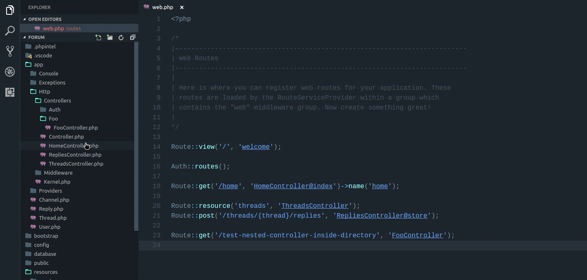
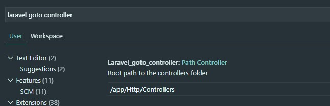

# No longer maintained

I wanted to say that the extension is no longer maintained. I do not code often and if/when I code it is not on PHP - Laravel.

The last couple of years commits where mostly for community's sake but since I am out of the loop I cannot commit to this project.

## laravel-goto-controller README

Alt + click to navigate from a route to a respective controller file.

Credits to https://github.com/codingyu/laravel-goto-view

## Alternative path for controllers

The extension supports non default directory paths, search in settings for `laravel goto controller` and set the desired path
of your application's controllers:

Marketplace link: https://marketplace.visualstudio.com/items?itemName=stef-k.laravel-goto-controller

## For latest updates see the CHANGELOG
